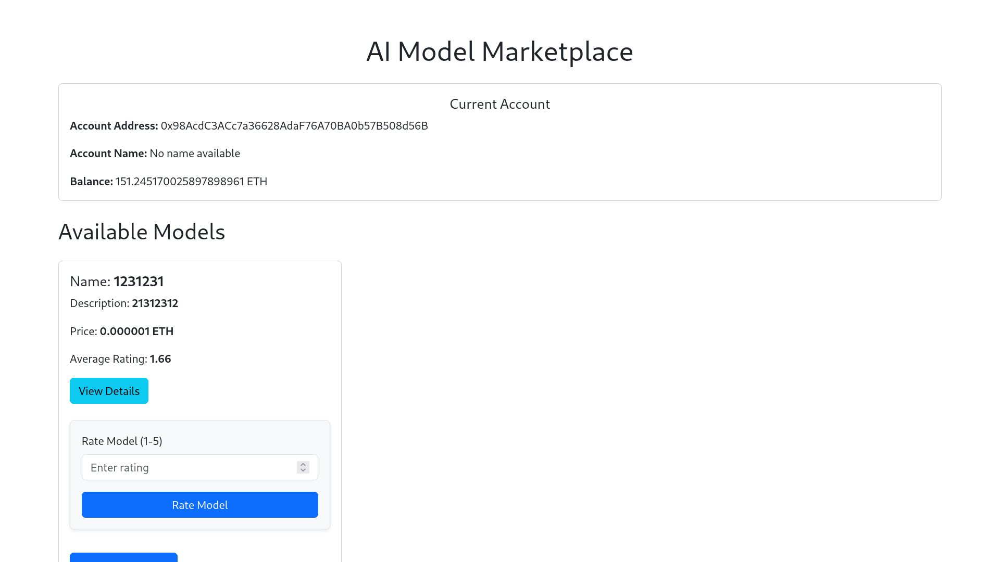
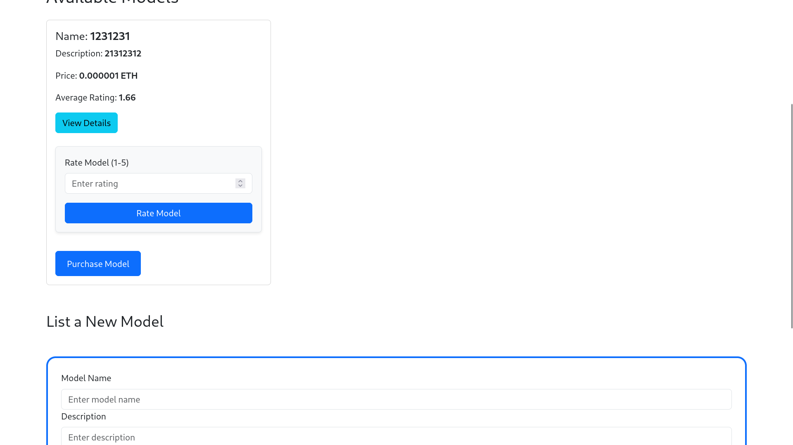
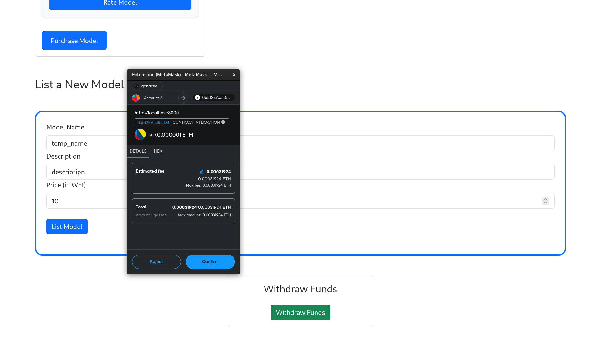
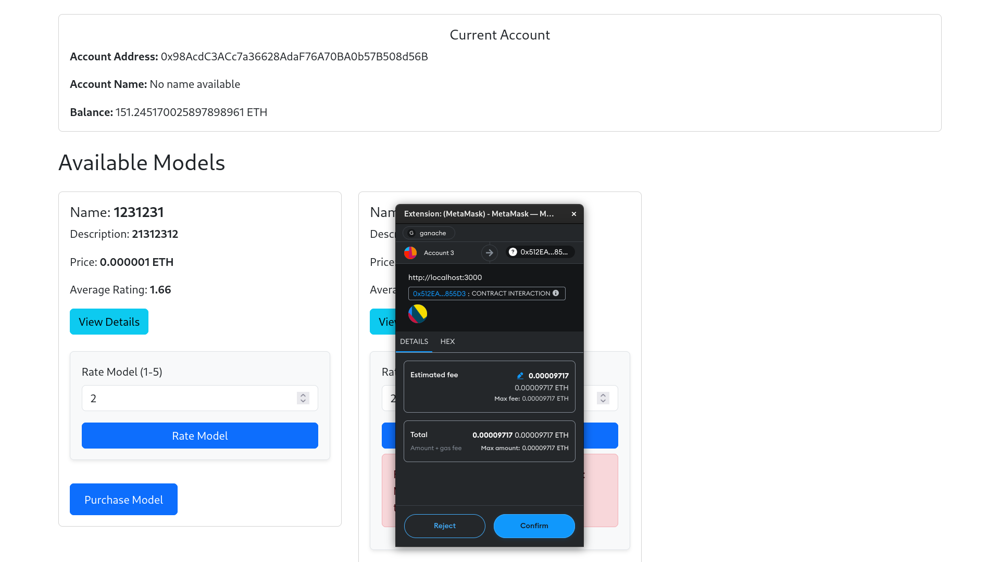
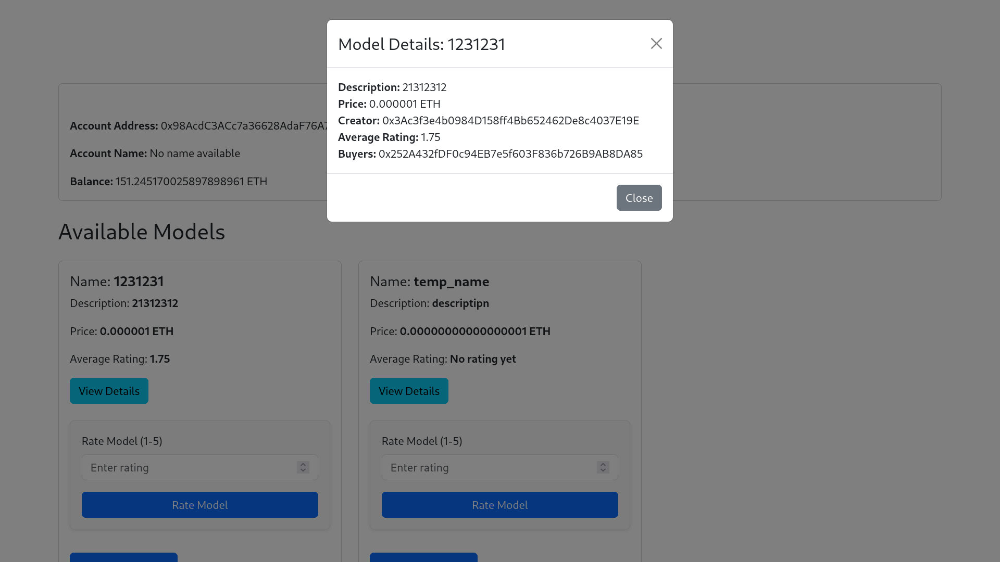
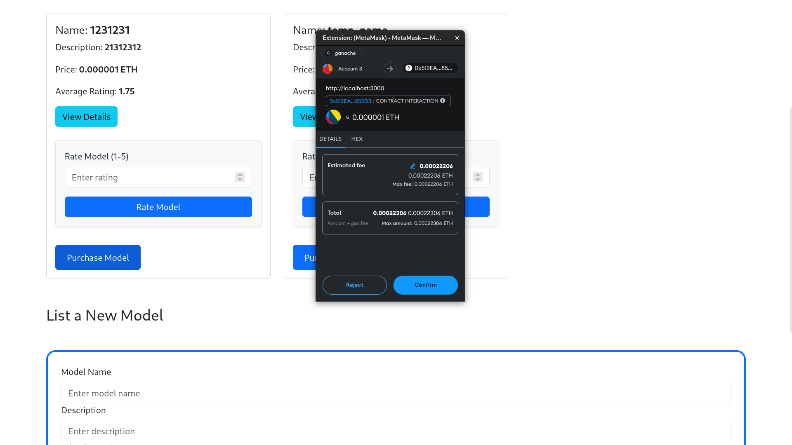
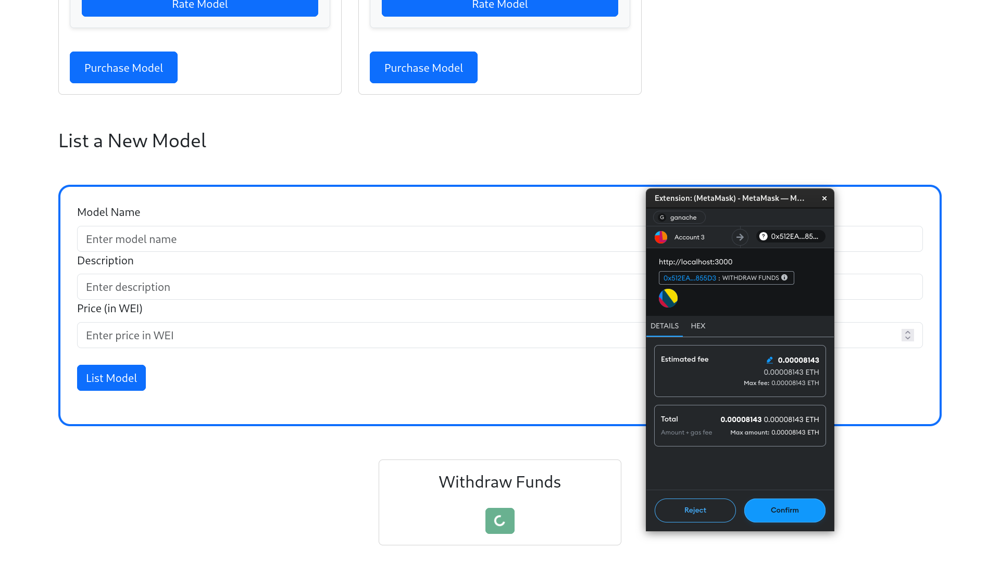

# AI Model Marketplace dApp

This dApp allows users to list, purchase, and rate AI models on a decentralized platform using the Ethereum blockchain.

## Usage

1. **Run Ganache**: Start the Ganache application to set up a local blockchain environment.

2. **Deploy the Smart Contract**: Use Truffle to deploy the smart contract. In your terminal, navigate to the project directory and run:
   ```bash
   truffle compile
   truffle migrate --network development
   ```

3. **Move Contract ABI**: After deployment, move the generated contract ABI from the build folder to the frontend:
   - AI_Model_Marketplace_dApp/frontend/src/abis/ContractABI.json

4. **Create env file in root dir**: 
    ```bash
    touch .env
    ```

5. **Copy Contract Address**: Copy the contract address from the Truffle migration output and paste it into your environment file as `CONTRACT_ADDRESS`.

6. **Move ABI to Frontend**: Copy the ABI from `AImodelMarketplace.json` to the frontend directory:
   ```bash
   cp AI_Model_Marketplace_dApp/build/contracts/AImodelMarketplace.json AI_Model_Marketplace_dApp/frontend/src/abis/ContractABI.json
   ```

7. **Start the Frontend**: Navigate to the frontend directory and start the application:
   ```bash
   cd AI_Model_Marketplace_dApp/frontend
   npm start
   ```


## Demo Screenshots

Here are some demo screenshots of the AI Model Marketplace dApp:








